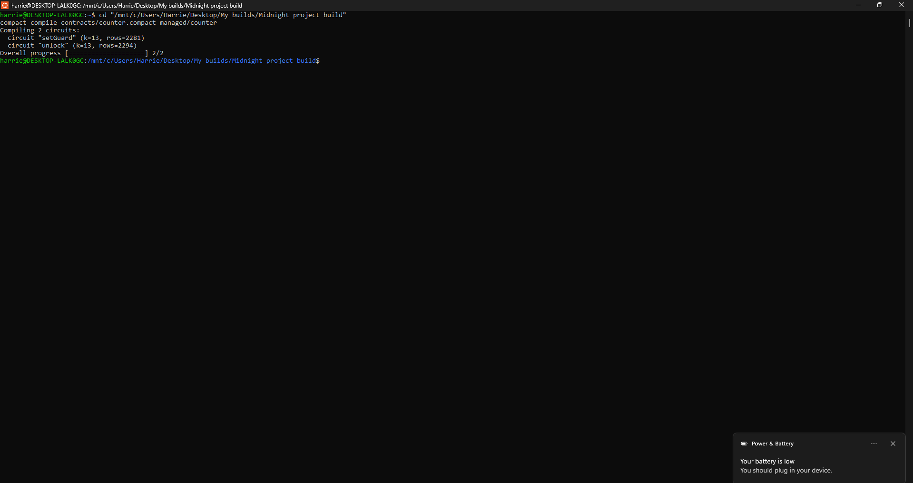
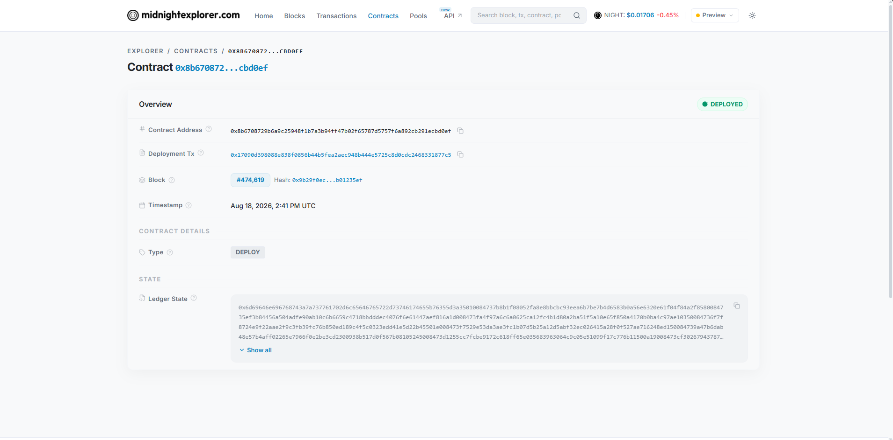

# Guarded Counter

[](https://github.com/IamHarrie-Labs/guarded-counter/actions/workflows/ci.yml)

> A counter that only moves for whoever can prove they hold the key — without that key ever touching the chain.

## Live Demo

https://guarded-counter.vercel.app

Connect Lace (set to the Preview network) to try it — click "Set Guard" once to lock the counter with a key generated in your browser, then "Unlock" to prove you hold it and bump the count.

## Contract address

| Network | Address |
|---------|---------|
| Preview | 8b6708729b6a9c25948f1b7a3b94ff47b02f65787d5757f6a892cb291ecbd0ef |

**A note on the network:** the frontend runs against Preview instead of Preprod. Preprod's own RPC/indexer has been down every time I've checked over several days — every attempt hangs indefinitely at wallet sync, before ever reaching a deploy. Midnight's own forum confirms Preprod is mid-reset for mainnet prep and "intermittently unavailable during testing." Preview is fully functional and this is the same contract, same circuits, same frontend — only the network target differs.

## What this does

It's a counter with a lock on it. The first person to call `setGuard` picks a secret key and the contract stores a hash of it on-chain — not the key itself, just the hash. After that, anyone who wants to call `unlock` and bump the counter has to prove they know a key that hashes to the same value. If the hash doesn't match, the call fails and the counter stays put.

Level 2 wires this up to an actual frontend: connect Lace, call `setGuard` or `unlock` straight from the browser, and watch the proof get generated locally before anything is submitted. Level 3 hardens it with a full test suite, CI on every push, and a product proposal in [PROPOSAL.md](PROPOSAL.md) for the survey tool this pattern becomes at Level 4.

## Privacy model

**What an on-chain observer can learn:**

- The current counter value, and that it went up.
- The guard commitment, which is a 32 byte hash published once by `setGuard`.
- That a transaction arrived from some wallet address, and that it satisfied the contract's assertions.
- That whoever called `unlock` held a key matching the stored commitment.

**What an on-chain observer cannot learn:**

- The guard key itself. It is passed in as a private witness, so it is only ever read inside a proof generated on the caller's own machine. It is not in the transaction, not in the ledger, and not recoverable from the commitment.
- Anything about the key from watching repeated calls. `unlock` can be called any number of times and the on-chain footprint is identical each time.
- Whether two different `unlock` calls came from the same person or different people holding the same key.

**What is proved without being revealed:** that the caller knows a preimage hashing to the stored commitment. That is the entire access control mechanism, and it never puts the key on chain.

In the frontend, the key is generated client side with `crypto.getRandomValues`, kept in `localStorage`, and never placed in a request body. The only thing that leaves the browser is the proof.

## Tech stack

Midnight network, Compact, Midnight.js SDK, React + Vite, Lace wallet, Node.js v22, Docker (for the local proof server).

## Prerequisites

- Node.js v22
- Docker Desktop, running
- The Compact toolchain (see setup below — on Windows this needs WSL2)
- The Lace wallet browser extension, with a Preview account

## Setup

```
git clone <your repo url>
cd guarded-counter
npm install
```

Compile the contract:

```
npm run compact
```

This generates the `managed/counter` folder with the compiled circuits and keys.

Start the proof server in a separate terminal (leave it running):

```
docker run -p 6300:6300 midnightntwrk/proof-server:8.1.0 midnight-proof-server -v
```

## Run tests

```
npm test
```

Or with each test named, which is the output shown in the screenshot below:

```
npm run test:verbose
```

10 tests across three areas:

- **Circuit logic** — `setGuard` publishes a commitment derived from the private key, refuses to run twice, and `unlock` only succeeds for a caller holding the matching key (and refuses entirely before a guard is set).
- **State transitions** — the counter starts at zero with the commitment unset, increments once per successful unlock, and stays put when an unlock is rejected.
- **Privacy** — the raw key never appears in ledger state, a caller without the key is rejected, and the same key always commits to the same value while different keys stay distinct.

## CI/CD

Every push and pull request to `main` runs [`.github/workflows/ci.yml`](.github/workflows/ci.yml), which checks out the repo, installs Node 22 and the Compact toolchain, compiles `counter.compact` from source, and runs the full test suite. The badge at the top of this README reflects the latest run.

## Run the frontend locally

```
npm run dev
```

Opens at `http://localhost:5173`. `VITE_NETWORK_ID` and `VITE_CONTRACT_ADDRESS` in `.env` control which network and contract the UI points at — make sure Lace is unlocked and set to the matching network.

## Initial idea

Most on-chain access control just checks if you're a specific wallet address. I wanted to try the opposite: you prove you know a secret without ever showing it, and the chain only ever sees a hash of it. A counter is about the simplest thing you can gate, so that's what I built first. The real idea behind it is anywhere you need to prove you're allowed to do something without revealing who you are, like private raffles, gated communities, or commit reveal games.

## Demo video

https://drive.google.com/file/d/1f6jjt3UtLLpEBAbq41HIJkB9jyUsFhwx/view?usp=sharing

## Screenshots

Compile output, both circuits building clean:



Contract live on Preview, confirmed on the block explorer:


